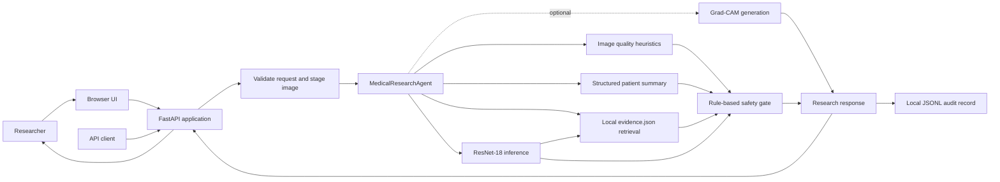
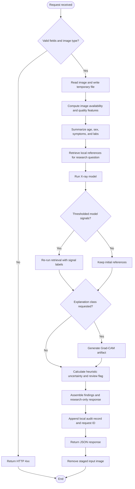
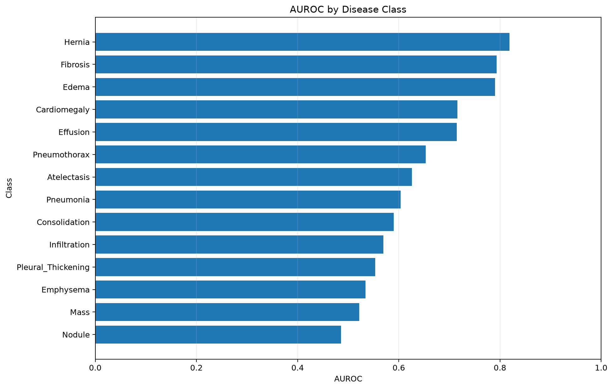
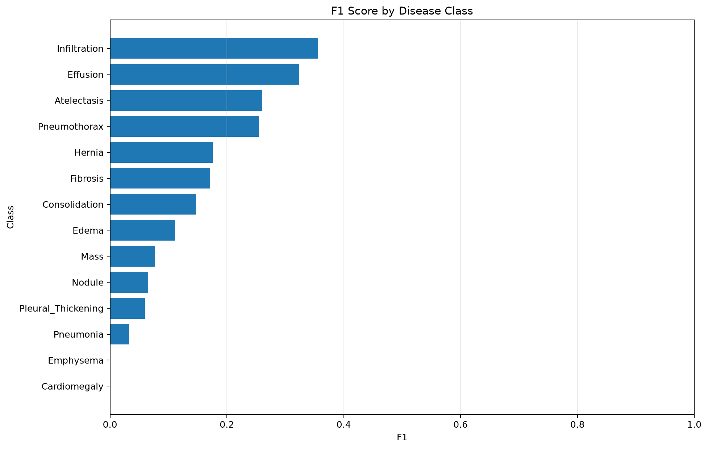
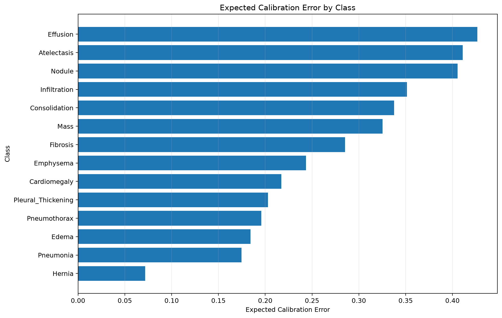
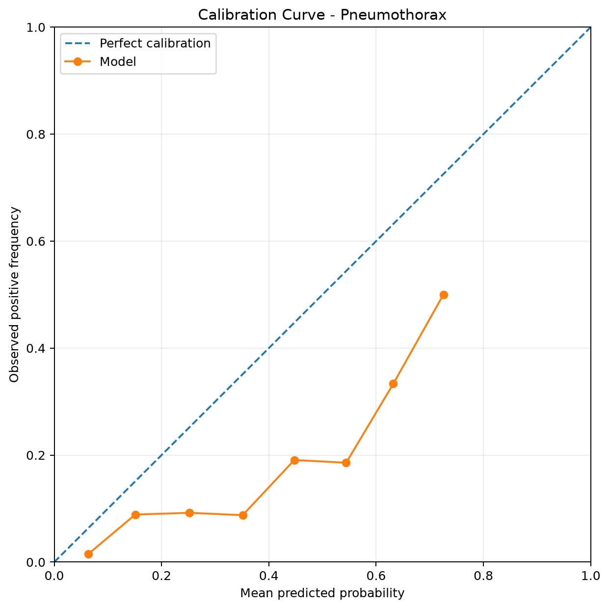
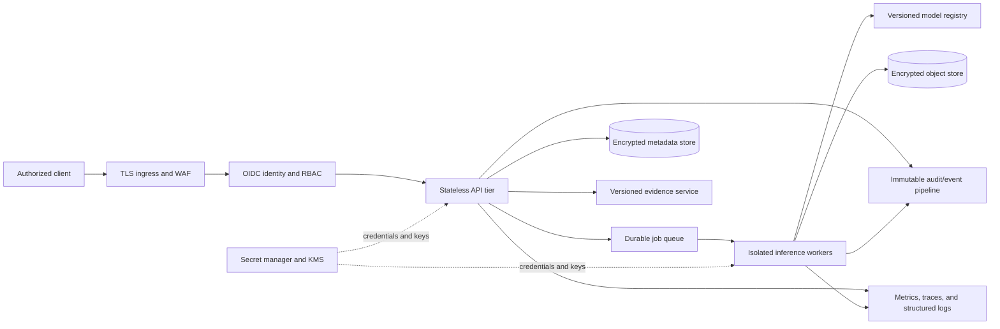

# MedAgent Vision

**MedAgent Vision** is a research prototype for experimenting with chest X-ray computer vision and multimodal agent orchestration. It combines image-quality heuristics, structured case summaries, a multi-label ResNet-18 model, local reference retrieval, optional Grad-CAM, and rule-based review escalation behind a FastAPI service.

> **Research use only.** This repository is not a medical device and is not validated for diagnosis, triage, prognosis, treatment, or patient-care decisions. Do not upload identifiable patient data. Model probabilities, retrieved references, and Grad-CAM visualizations are research signals, not clinical conclusions.

## System at a glance

| Area | Current implementation |
| --- | --- |
| User interface | Single-page HTML interface served by FastAPI |
| API | FastAPI endpoints for agent, image inference, explanation, health, and disclaimer |
| Orchestration | Synchronous Python `MedicalResearchAgent` |
| Vision model | CPU ResNet-18, 14 labels, checkpoint loaded from `artifacts/` |
| Calibration | Optional per-label Platt parameters; raw model outputs are retained |
| Evidence | Local JSON records ranked with weighted token overlap |
| Safety | Heuristic image-quality and evidence checks plus model uncertainty escalation |
| Audit | Local append-only JSON Lines file at `artifacts/audit.jsonl` |
| Runtime | Single container/process in the supplied Docker Compose configuration |

This is a deliberately compact research architecture. It does **not** currently provide authentication, authorization, durable job processing, distributed storage, multi-tenant isolation, clinical workflow integration, or production service-level guarantees.

## Architecture

### Current runtime



The application constructs the model engine during module import and runs inference synchronously on CPU. The current deployment is therefore best suited to local experiments and low-volume demonstrations, not concurrent production traffic.

### Request lifecycle



The safety gate is a lightweight escalation heuristic. It considers image availability/quality and evidence availability, then combines this result with the model's uncertainty and review flag. Its thresholds have **not** been established as clinical decision limits. A `HUMAN_REVIEW_REQUIRED` status does not make an output safe or clinically actionable.

### Component boundaries

| Component | Location | Responsibility |
| --- | --- | --- |
| HTTP routes and upload handling | `app/main.py` | Serve the UI, validate basic request constraints, stage uploads, invoke services, and return JSON |
| Orchestration | `app/agents/orchestrator.py` | Coordinate vision, patient summary, model, evidence, Grad-CAM, safety, and audit steps |
| Request/response models | `app/schemas/models.py` | Define typed patient and analysis request structures |
| Image-quality analysis | `app/tools/vision.py` | Derive generic pixel and image-quality features; it does not identify disease |
| Patient summary | `app/tools/patient.py` | Summarize supplied fields and simple flags; it does not infer a diagnosis |
| Evidence retrieval | `app/tools/evidence.py` | Rank local `data/evidence.json` entries using token overlap |
| X-ray inference | `app/ml/chest_xray_inference.py` | Load ResNet-18 weights and produce per-label model outputs |
| Explainability | `app/explainability/gradcam.py` | Generate a Grad-CAM image for a selected model label |
| Safety and audit | `app/services/` | Apply review heuristics and write request records to local JSONL |
| Browser UI | `app/static/index.html` | Collect research inputs and render assessment, findings, evidence, and explanations |

### Research figures

The repository includes offline evaluation artifacts for reviewing model behavior. These plots are included for research transparency; they are specific to their source run and evaluation data and do not establish external validity or clinical performance.

<p align="center">
     <a href="artifacts/evaluation_dashboard/plots/auroc_by_class.png"></a>
     <a href="artifacts/evaluation_dashboard/plots/f1_by_class.png"></a>
</p>
<p align="center"><sub>AUROC by class · F1 score by class</sub></p>

<p align="center">
     <a href="artifacts/calibration/plots/ece_by_class.png"></a>
     <a href="artifacts/calibration/plots/calibration_Pneumothorax.png"></a>
</p>
<p align="center"><sub>Expected calibration error by class · Pneumothorax calibration curve</sub></p>

## API

The interactive OpenAPI reference is available at `/docs` when the service is running.

| Method | Path | Purpose |
| --- | --- | --- |
| `GET` | `/` | Serve the research interface |
| `GET` | `/health` | Basic process response and static service/model metadata; not a full readiness check |
| `GET` | `/research-disclaimer` | Return the research-use disclaimer |
| `POST` | `/analyze` | Run the orchestrator with a JSON `AnalysisRequest` |
| `POST` | `/analyze-image` | Run image-model inference for a multipart image upload |
| `POST` | `/explain-image` | Generate a Grad-CAM artifact for a multipart image upload and label |
| `POST` | `/agent-analyze-image` | Run the combined image and patient-context research flow used by the UI |
| `GET` | `/artifacts/{path}` | Serve files from the local artifacts directory |

The upload routes accept PNG, JPG/JPEG, BMP, and WEBP by filename extension and enforce a 20 MiB application-level limit. Uploads are staged in a temporary file and removed after request handling. Grad-CAM outputs and audit records are written to the local `artifacts/` directory. These local-file behaviors are not a substitute for access-controlled object storage or a managed audit system.

## Data handling and trust boundaries

- The application accepts age, sex, symptoms, a research question, and an image. Treat all of these as sensitive, even though the prototype requests no name or medical-record number.
- The uploaded image is temporarily written to disk and deleted in a `finally` block. The application reads the complete upload into memory before checking the 20 MiB limit; deployments need an upstream request-size limit and streaming safeguards.
- The audit record contains analysis output, including a patient summary, model results, and status. The JSONL file has no built-in encryption, access control, retention policy, tamper evidence, or redaction.
- Grad-CAM files are saved under `artifacts/` and exposed through the static artifacts route. There is no per-user authorization or expiry mechanism.
- The evidence corpus is a local JSON file. Retrieval is a simple relevance heuristic, not a literature search service and not a source of clinical validation.
- Model checkpoints are loaded from the repository's `artifacts/` directory. Only use trusted, integrity-checked checkpoints; PyTorch checkpoint loading can execute unsafe pickle content.
- Do not expose this prototype directly to the public internet or use real patient data.

## Run locally

Run all commands from the repository directory that contains `app/`, `requirements.txt`, and `docker-compose.yml` (in this workspace: `medical_ai_agent/`). Python 3.12 is the container runtime version used by the included Dockerfile.

### Windows PowerShell

```powershell
cd medical_ai_agent
py -3.12 -m venv .venv
.venv\Scripts\Activate.ps1
python -m pip install --upgrade pip
python -m pip install -r requirements.txt
python -m uvicorn app.main:app --reload --host 127.0.0.1 --port 8000
```

### macOS, Linux, or Git Bash

```bash
cd medical_ai_agent
python3.12 -m venv .venv
source .venv/bin/activate
python -m pip install --upgrade pip
python -m pip install -r requirements.txt
python -m uvicorn app.main:app --reload --host 127.0.0.1 --port 8000
```

Open `http://127.0.0.1:8000/` for the UI or `http://127.0.0.1:8000/docs` for OpenAPI. Keep the UI and API on this same origin; serving `index.html` from a static-only server will make its analysis `POST` requests fail.

The model checkpoint must exist at `artifacts/chest_xray_resnet18_weighted.pt`. Optional threshold and calibration files are read from `artifacts/evaluation/` and `artifacts/calibration_recalibration/`; missing threshold data falls back to `0.5`, and missing calibration data leaves probabilities uncalibrated. The service currently selects CPU inference in code.

### Docker Compose

```bash
docker compose up --build
```

Then open `http://127.0.0.1:8000/`. The supplied Compose file is a single-service development/demo deployment; it does not configure TLS, authentication, resource limits, persistent volumes, health-based orchestration, or horizontal scaling.

## Development checks

Generate the synthetic smoke-test image:

```bash
python scripts/generate_sample_image.py
```

Run tests:

```bash
python -m pytest -q
```

Run the command-line demo:

```bash
python scripts/run_demo.py
```

Use only synthetic or appropriately de-identified data during development. Do not commit datasets, user uploads, generated patient artifacts, secrets, or local audit records.

## Production-readiness target

The following diagram is a **target architecture**, not a description of what this repository currently deploys. It illustrates the controls to design and validate before operating a multi-user, internet-accessible service.



### Readiness gates before a real deployment

- **Clinical and intended-use governance:** define intended users and intended use; complete required clinical, privacy, security, and regulatory reviews; establish human oversight and incident processes.
- **Model evidence:** establish dataset provenance and permitted use; prevent patient-level leakage; evaluate external sites, subgroups, calibration, drift, and out-of-distribution inputs; version model weights, thresholds, preprocessing, and evaluation reports together.
- **Identity and privacy:** add authentication, authorization, tenant isolation, least privilege, consent/legal basis, de-identification, encryption in transit and at rest, controlled retention, and tested deletion procedures.
- **API hardening:** enforce streaming body limits, MIME/content validation, rate limits, timeouts, concurrency limits, CSRF/CORS policy where applicable, safe error responses, and abuse monitoring at the edge and application layers.
- **Data and artifacts:** move uploads and generated explanations to access-controlled encrypted storage; use scoped, expiring retrieval; prevent sensitive content from appearing in URLs, logs, or error messages.
- **Auditability:** replace the local JSONL file with a durable, access-controlled, tamper-evident event pipeline; define retention and redaction rules; restrict audit payloads to the minimum necessary.
- **Reliability:** isolate inference into bounded workers; add queue backpressure, retries with idempotency, graceful shutdown, readiness/liveness probes, resource quotas, backups, and tested recovery objectives.
- **Operations:** add structured logs, service and model metrics, distributed traces, dashboards, alerts, dependency and image scanning, SBOM generation, signed artifacts, secret rotation, and an incident-response runbook.
- **Release quality:** add CI checks for formatting, types, unit/integration tests, API contract compatibility, image validation, model regression, and deployment rollback. Pin and review dependency versions for release builds.

## Dataset and model governance

The repository includes synthetic smoke-test data and model/evaluation artifacts; it is not a licensed clinical dataset distribution. See [DATASET.md](DATASET.md) for dataset access notes. Follow each dataset's license, access policy, citation requirements, and de-identification rules. Never place downloaded clinical datasets in Git.

For any research evaluation, track dataset version and source, patient-level splits, preprocessing, checkpoint hash, label mapping, thresholds, calibration artifacts, metrics, and known limitations. The existence of evaluation files in this repository does not establish external validity or clinical performance.

## Repository map

```text
app/
  agents/          Orchestration and response assembly
  explainability/  Grad-CAM implementation
  ml/              X-ray model loading and inference
  schemas/         API request/response models
  services/        Safety heuristic and local audit writer
  static/          Browser research interface
  tools/           Image, patient-summary, and evidence tools
artifacts/         Model weights, evaluation outputs, audit, and generated explanations
data/              Local evidence and dataset working directories
scripts/           Demo and data-generation utilities
tests/             API and core behavior tests
training/          Dataset, training, evaluation, and calibration workflows
```

## Research roadmap

1. Validate image ingestion and support DICOM only with a reviewed de-identification pipeline.
2. Replace heuristic evidence matching with a licensed, versioned corpus and measurable retrieval evaluation.
3. Establish reproducible, patient-level model evaluation and robust subgroup/external validation.
4. Add calibrated uncertainty and OOD handling with documented operating characteristics.
5. Implement the identity, privacy, storage, audit, observability, and reliability controls listed above.
6. Complete independent security, privacy, clinical, and regulatory review before any real-world use.
